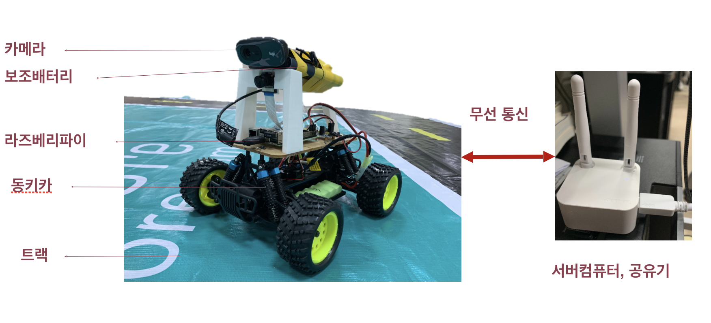
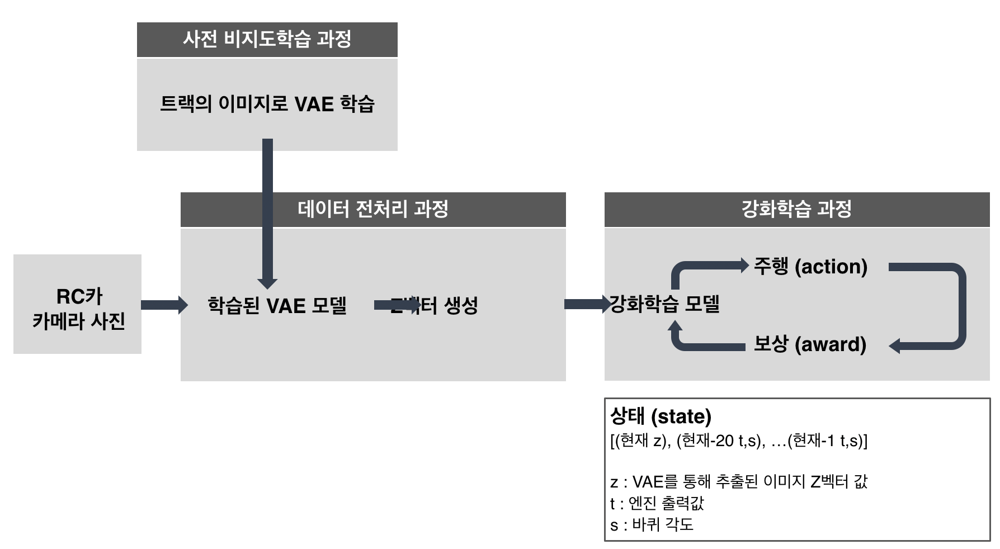

# Donkey car를 활용한 강화학습 자율 주행 AI

### 시연 영상

### 활용 장비

- 라즈베리파이에 연결된 웹캠에서 트랙 이미지를 받아 서버컴퓨터로 전송
- 전송된 이미지를 서버컴퓨터에서 학습하여 조향 및 속도를 라즈베리파이에 전송
- 라즈베리파이에서 학습시키는 방법이 동키카를 제어하기는 쉬우나 연산속도가 느려서 통신을 사용하게 됨

### 프로세스

1. 미리 촬영된 트랙 이미지로 VAE(Variational AutoEncoder) 학습시킴
2. 라즈베리파이에서 받은 트랙이미지를 학습된 VAE 모델에 넣어 Z벡터 생성
3. z벡터를 강화학습 모델의 입력값으로 받고, 주행을 하고 트랙을 벗어나면 키를 눌러 동키카를 정지시킴
4. 동키카가 정지하게 되면 리워드 받음(어떻게 받는지 적기)

##### VAE(Variable AutoEncoder)란?

- GAN과 비슷한 생성모델로, encoder에서 잠재적인 특징을 추출하고 decoder에서 이 특징을 바탕으로 원래 화면으로 복원
- 사용 이유
    - 차원을 낮추거나 정보의 특징을 이용하면 강화학습 효율이 높아진다는 논문 존재(State representation learning for control: An overview( 2018)
    - VAE가 특징을 보는 사람이 사물을 보는 방식을 적용

### 최종 - 현실에서 강화학습

- 학습에 적절한 속도 지정
    - 최저속도가 너무 낮은 경우 움직이지 않음
    
        - 정지 마찰력 이상의 힘이 주어지지 못하기 때문
        - 너무 낮은 속도에서는 모터가 돌아가지 않기 때문으로 추정
    - 최고속도가 너무 높은 경우 트랙을 벗어남
    
        - 학습을 통해 경로를 재설정하기에 너무 시간이 짧기 때문으로 추정

- 딜레이 문제
    - step 속도가 빨라 학습이 잘 되지 않음
    - 학습 및 통신에 의한 딜레이가 생기는 것으로 생각됨
        - step 조정 전
        

        - step 조정 후
        

- 시뮬레이션을 통한 강화학습도 시도해보았지만 유니티를 통해 실제 환경과 유사하게 구축하는 데 어려움이 있어 현실에서 강화학습을 하게 됨

### 개선점

- 유니티 시뮬레이션 환경을 최대한 현실과 가깝게 통제
- 정지 시 육안으로 확인 후 정지버튼을 눌러 정지시켰기 때문에 반응속도가 느렸을것으로 생각됨 -> RGB 센서나 line detection을 통해 차선이 인식되면 저절로 멈추는 시스템 구축
- parameter를 경험적으로 정하기 보다는 근거를 찾기
